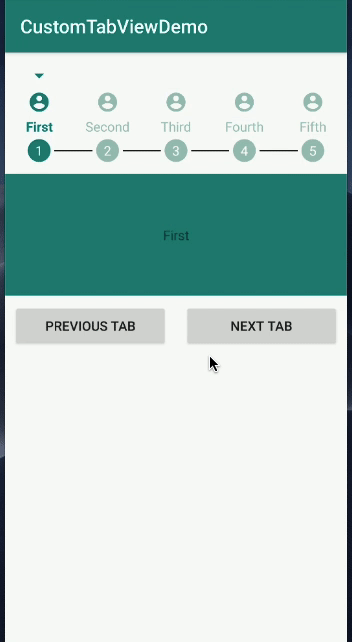

# CustomTabView
A fully customized tab view on the go!

#### Features:
- Configure tabs with or without titles
- Configure tabs with or without selected and unselected icons
- Configure tabs with or without selected and unselected title color
- Configure tabs with or without completed icons and completed title color
- Configure tabs with or without the drop down arrow for current selected tab
- Configure tabs with or without the step count wizard
- Configure tabs with optional behaviour **Movable to Next Tab** or **Not Movable to Next Tab**

#### Current Version:
[](https://jitpack.io/#ar9t4/customtabview)

#### Demo:


#### Setup:

###### Step 1:
Add it in your root build.gradle at the end of repositories

```sh
allprojects {
    repositories {
        ...
        maven { url 'https://jitpack.io' }
    }
}
```
###### Step 2:
Add the dependency

```sh
dependencies {
    implementation 'com.github.ar9t4:customtabview:current_version'
}
```

#### Usage:
```sh
TabLayout tabs = findViewById(R.id.tabs);
# you can get NonSwipeAbleViewPager widget from the demo module otherwise you can also use ViewPager
NonSwipeAbleViewPager viewPager = findViewById(R.id.pages);
       
Bundle bundle = new Bundle();
bundle.putString("name", getString(R.string.first));
PageFragment page1 = new PageFragment();
page1.setArguments(bundle);

bundle = new Bundle();
bundle.putString("name", getString(R.string.second));
PageFragment page2 = new PageFragment();
page2.setArguments(bundle);

bundle = new Bundle();
bundle.putString("name", getString(R.string.third));
PageFragment page3 = new PageFragment();
page3.setArguments(bundle);

bundle = new Bundle();
bundle.putString("name", getString(R.string.fourth));
PageFragment page4 = new PageFragment();
page4.setArguments(bundle);

bundle = new Bundle();
bundle.putString("name", getString(R.string.fifth));
PageFragment page5 = new PageFragment();
page5.setArguments(bundle);

ArrayList<Fragment> pages = new ArrayList<>();
pages.add(page1);
pages.add(page2);
pages.add(page3);
pages.add(page4);
pages.add(page5);

int[] titles = {R.string.first, R.string.second, R.string.third, R.string.fourth, R.string.fifth};
int[] selectedIcons = {R.drawable.ic_profile_selected, R.drawable.ic_profile_selected,
                R.drawable.ic_profile_selected, R.drawable.ic_profile_selected,
                R.drawable.ic_profile_selected};
int[] completedIcons = {R.drawable.ic_profile_completed, R.drawable.ic_profile_completed,
                R.drawable.ic_profile_completed, R.drawable.ic_profile_completed,
                R.drawable.ic_profile_completed};
int[] unSelectedIcons = {R.drawable.ic_profile_unselected, R.drawable.ic_profile_unselected,
                R.drawable.ic_profile_unselected, R.drawable.ic_profile_unselected,
                R.drawable.ic_profile_unselected};

CustomTabPagerAdapter pagerAdapter = new CustomTabPagerAdapter.Builder(this, tabs, pages, getSupportFragmentManager(),
        FragmentPagerAdapter.BEHAVIOR_RESUME_ONLY_CURRENT_FRAGMENT)
        .setShowArrow(true)
        .setTitles(titles)
        .setSelectedColor(ContextCompat.getColor(this, R.color.colorSelected))
        .setCompletedColor(ContextCompat.getColor(this, R.color.colorCompleted))
        .setUnSelectedColor(ContextCompat.getColor(this, R.color.colorUnSelected))
        .setSelectedIcons(selectedIcons)
        .setCompletedIcons(completedIcons)
        .setUnselectedIcons(unSelectedIcons)
        .setShowStepCount(true)
        .setTabBehaviour(CustomTabPagerAdapter.Builder.TabBehaviour.NOT_MOVABLE_TO_NEXT_TAB)
        .build();

viewPager.setPagingEnabled(false);
viewPager.setAdapter(pagerAdapter);

tabs.addOnTabSelectedListener(pagerAdapter);
tabs.setupWithViewPager(viewPager);

for (int i = 0; i < pagerAdapter.getCount(); i++) {
    TabLayout.Tab tab = tabs.getTabAt(i);
    if (null != tab)
        tab.setCustomView(pagerAdapter.getTabView(i));
}
```
